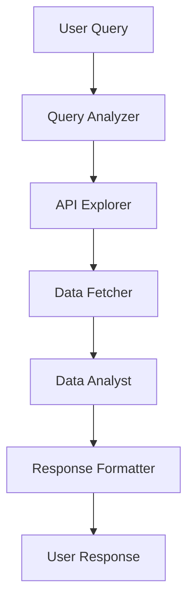

# SP-API CrewAI Chatbot - Complete Project Documentation

## 🎯 Project Overview

The SP-API CrewAI Chatbot is a sophisticated, multi-component system that provides intelligent conversational access to Amazon's Selling Partner API (SP-API) using CrewAI for agent orchestration. The system enables natural language queries about orders, sales, inventory, and other Amazon seller data through an intuitive chat interface.

## 🏗️ System Architecture

The project follows a microservices architecture with four main components:

```
┌─────────────────────────────────────────┐
│  Frontend (React)                       │
│  http://localhost:3000                  │
└───────────────┬─────────────────────────┘
                │
                │ HTTP Requests
                │
                ▼
┌─────────────────────────────────────────┐
│  Backend (Flask)                        │
│  http://localhost:5000                  │
│                                         │
│  Routes:                                │
│  • /v1/chat/completions    ◄─┐        │
│  • /v1/sessions             │          │
│  • /api/sp-analytics/query  │          │
│  • /api/sp-analytics/health │          │
└─────────────────────────────────┼───────┘
                      Proxies to  │
                                  │
                                  ▼
┌─────────────────────────────────────────┐
│  SP-API Agent System (CrewAI)           │
│  http://localhost:5001                  │
│                                         │
│  • /v1/chat/completions                 │
│  • /v1/sessions                         │
│  • /health                              │
└───────────────┬─────────────────────────┘
                │
                │
                ▼
┌─────────────────────────────────────────┐
│  MCP Server                             │
│  http://localhost:7000                  │
└─────────────────────────────────────────┘
```

## 📁 Project Structure

```
spapi-crewai-chatbot/
├── 📁 frontend/                    # React frontend application
│   ├── 📁 src/
│   │   ├── 📁 components/          # React components
│   │   ├── 📁 services/           # API services
│   │   ├── 📁 styles/             # CSS styles
│   │   ├── App.tsx               # Main app component
│   │   └── config.ts             # Configuration
│   ├── package.json              # Frontend dependencies
│   └── Dockerfile               # Frontend container
│
├── 📁 backend/                     # Flask backend API
│   ├── web_interface.py          # Main Flask application
│   ├── spapi_crewai_chatbot.py   # Core chatbot logic
│   ├── advanced_chatbot.py      # Enhanced chatbot features
│   ├── config.py                # Backend configuration
│   ├── requirements.txt          # Python dependencies
│   └── Dockerfile               # Backend container
│
├── 📁 sp-api-agent-system/         # CrewAI agent system
│   ├── sp_api_agent_system.py    # Main agent orchestrator
│   ├── config.py                # Agent configuration
│   ├── requirements.txt         # Agent dependencies
│   └── Dockerfile              # Agent container
│
├── 📁 mcp-http-wrapper/           # MCP HTTP wrapper
│   ├── server.js               # HTTP wrapper server
│   ├── package.json           # Node.js dependencies
│   └── README.md             # Wrapper documentation
│
│
├── 📁 selling-partner-api-models/ # Amazon SP-API models
├── docker-compose.yml           # Docker orchestration
├── README.md                   # Project overview
├── ARCHITECTURE_SUMMARY.md     # Architecture details
└── PROJECT_DOCUMENTATION.md    # This documentation
```

## 🚀 Component Details

### 1. Frontend (React) - Port 3000

**Location**: `frontend/`

**Technology Stack**:
- React 18.2.0 with TypeScript
- Axios for HTTP requests
- CSS3 for styling

**Features**:
- Real-time chat interface with typing indicators
- Session management with unique session IDs
- Quick action buttons for common queries
- Responsive design with modern UI
- Error handling and loading states

**Configuration**:
```typescript
// frontend/src/config.ts
export const BACKEND_CONFIG = {
    baseURL: process.env.REACT_APP_BACKEND_URL || 'http://localhost:5000',
    model: 'sp-api-crewai',
    streamingEnabled: true
};
```

**API Integration**:
- Connects to backend on `http://localhost:5000`
- Uses OpenAI-compatible API format
- Supports session-based conversations
- Handles streaming responses

### 2. Backend (Flask) - Port 5000

**Location**: `backend/`

**Technology Stack**:
- Flask 3.0.0 with CORS support
- Python 3.8+
- CrewAI integration
- HTTP client for MCP communication

**Key Files**:
- `web_interface.py`: Main Flask application with API routes
- `spapi_crewai_chatbot.py`: Core chatbot with MCP integration
- `advanced_chatbot.py`: Enhanced features (context, caching)
- `config.py`: Configuration management

**API Endpoints**:
```python
# Main API routes
POST /v1/chat/completions    # Chat completions (proxied to agent system)
POST /v1/sessions           # Session management (proxied)
POST /api/sp-analytics/query # Analytics queries (proxied)
GET  /api/sp-analytics/health # Health check (proxied)
GET  /health                 # Backend health check
```

**Features**:
- Request proxying to SP-API Agent System
- Session management
- Error handling and logging
- CORS support for frontend integration
- Health monitoring

**Configuration**:
```python
# Environment variables
AGENT_URL=http://localhost:5001        # SP-API Agent System URL
MCP_SERVER_URL=http://localhost:7000   # MCP Server URL
AWS_REGION=us-east-1                  # AWS region
```

### 3. SP-API Agent System (CrewAI) - Port 5001

**Location**: `sp-api-agent-system/`

**Technology Stack**:
- CrewAI 0.28.0+ for multi-agent orchestration
- Flask for API endpoints
- OpenAI GPT-4 for LLM capabilities
- HTTP client for MCP communication

**Key Features**:
- Multi-agent workflow with specialized roles
- Intelligent query analysis and endpoint selection
- Structured data models with Pydantic validation
- Comprehensive error handling and retry logic
- Production-ready logging and monitoring

**Agent Roles**:
1. **Query Analyzer**: Understands user intent and extracts entities
2. **API Explorer**: Finds appropriate SP-API endpoints
3. **Data Fetcher**: Executes API requests with proper parameters
4. **Data Analyst**: Analyzes and processes API responses
5. **Response Formatter**: Creates user-friendly responses

**Workflow Process**:
```python
# Multi-agent workflow
1. Analyze user query → Extract intent, entities, time ranges
2. Explore API catalog → Find relevant SP-API endpoints
3. Execute API request → Call Amazon SP-API with proper auth
4. Analyze data → Process and extract insights
5. Format response → Create clear, actionable response
```

**API Endpoints**:
```python
POST /v1/chat/completions    # Main chat endpoint
POST /v1/sessions           # Session creation
GET  /health               # System health check
```

**Configuration**:
```python
# Agent system configuration
OPENAI_API_KEY=your_openai_key
MODEL_NAME=gpt-4o
MCP_SERVER_URL=http://localhost:7000
FLASK_PORT=5001
AGENT_VERBOSE=True
```

### 4. MCP HTTP Wrapper - Port 7000

**Location**: `mcp-http-wrapper/`

**Technology Stack**:
- Node.js with Express
- Child process management for MCP server
- JSON-RPC protocol handling
- Timeout and error management

**Purpose**:
- Provides HTTP REST API for MCP server
- Handles JSON-RPC communication with MCP server
- Manages process lifecycle and timeouts
- Converts MCP protocol to HTTP requests

**API Endpoints**:
```javascript
GET  /health              # Server health check
POST /api/execute         # Execute SP-API requests
POST /api/explore         # Explore SP-API catalog
GET  /api/test            # Basic connectivity test
```

**Key Features**:
- Process spawning and management
- JSON-RPC request/response handling
- 30-second timeout protection
- Comprehensive error handling
- Request logging and debugging

**Configuration**:
```javascript
// Environment variables
PORT=7000
MCP_SERVER_PATH=../sp-api-mcp-server/build/index.js
```

### 5. SP-API MCP Server

**Location**: `sp-api-mcp-server/`

**Technology Stack**:
- TypeScript with Node.js
- Model Context Protocol (MCP) SDK
- AWS4 authentication for SP-API
- Zod for schema validation

**Key Components**:
- `index.ts`: Main MCP server entry point
- `tools/`: SP-API execution tools
- `auth/`: Amazon SP-API authentication
- `catalog/`: API catalog management
- `utils/`: Utility functions

**MCP Tools**:
1. **execute-sp-api**: Execute Amazon SP-API requests
2. **explore-sp-api-catalog**: Browse available endpoints

**Features**:
- Full SP-API authentication handling
- Endpoint discovery and exploration
- Request parameter validation
- Response formatting and error handling
- Comprehensive logging

## 🔧 Configuration & Environment Variables

### Required Environment Variables

```bash
# OpenAI Configuration
OPENAI_API_KEY=your_openai_api_key
MODEL_NAME=gpt-4o

# Amazon SP-API Credentials
SP_API_CLIENT_ID=your_sp_api_client_id
SP_API_CLIENT_SECRET=your_sp_api_client_secret
SP_API_REFRESH_TOKEN=your_sp_api_refresh_token

# AWS Configuration
AWS_REGION=us-east-1
AWS_ACCESS_KEY_ID=your_aws_access_key
AWS_SECRET_ACCESS_KEY=your_aws_secret_key

# Service URLs (for Docker)
AGENT_URL=http://sp-api-agent:5001
MCP_SERVER_URL=http://mcp-server:7000
REACT_APP_BACKEND_URL=http://backend:5000
```

### Service Ports

| Service | Port | Purpose |
|--------|------|---------|
| Frontend | 3000 | React development server |
| Backend | 5000 | Flask API server |
| SP-API Agent | 5001 | CrewAI agent system |
| MCP Wrapper | 7000 | HTTP wrapper for MCP |
| Frontend (Docker) | 80 | Production frontend |

## 🐳 Docker Deployment

### Docker Compose Configuration

The project includes a comprehensive `docker-compose.yml` that orchestrates all services:

```yaml
services:
  mcp-server:        # MCP server on port 7000
  sp-api-agent:      # CrewAI agents on port 5001
  backend:           # Flask API on port 5000
  frontend:          # React app on port 80
```

### Deployment Commands

```bash
# Start all services
docker-compose up -d

# View logs
docker-compose logs -f

# Stop services
docker-compose down

# Rebuild and restart
docker-compose up --build -d
```

## 🚀 Development Setup

### Prerequisites

- Python 3.8+
- Node.js 16+
- Docker (optional)
- Amazon SP-API credentials
- OpenAI API key

### Local Development

1. **Backend Setup**:
```bash
cd backend
python -m venv venv
source venv/bin/activate  # Windows: venv\Scripts\activate
pip install -r requirements.txt
python web_interface.py
```

2. **Frontend Setup**:
```bash
cd frontend
npm install
npm start
```

3. **SP-API Agent Setup**:
```bash
cd sp-api-agent-system
python -m venv venv
source venv/bin/activate
pip install -r requirements.txt
python sp_api_agent_system.py
```

4. **MCP Wrapper Setup**:
```bash
cd mcp-http-wrapper
npm install
npm start
```

### Production Deployment

```bash
# Using Docker Compose
docker-compose up -d

# Or individual services
docker build -t spapi-frontend ./frontend
docker build -t spapi-backend ./backend
docker build -t spapi-agent ./sp-api-agent-system
```

## 📊 Data Flow

### Complete Request Flow

1. **User Input**: User types message in React frontend
2. **Frontend → Backend**: HTTP POST to `/v1/chat/completions`
3. **Backend → Agent System**: Proxy request to agent system
4. **Agent System → MCP Wrapper**: HTTP request to MCP server
5. **MCP Wrapper → MCP Server**: JSON-RPC call to MCP server
6. **MCP Server → Amazon SP-API**: Authenticated API request
7. **Response Chain**: Data flows back through the entire chain

### Agent Workflow



## 🛠️ Key Features

### Frontend Features
- **Real-time Chat**: Instant messaging with typing indicators
- **Session Management**: Persistent conversation history
- **Quick Actions**: Predefined queries for common tasks
- **Responsive Design**: Works on desktop and mobile
- **Error Handling**: Graceful error messages and recovery

### Backend Features
- **Request Proxying**: Seamless communication between services
- **Session Management**: Unique session IDs for conversations
- **Health Monitoring**: Service health checks and status
- **CORS Support**: Cross-origin request handling
- **Logging**: Comprehensive request and error logging

### Agent System Features
- **Multi-Agent Workflow**: Specialized agents for different tasks
- **Intelligent Analysis**: Natural language understanding
- **Endpoint Discovery**: Automatic SP-API endpoint selection
- **Data Processing**: Smart data analysis and insights
- **Error Recovery**: Robust error handling and retry logic

### MCP Integration Features
- **HTTP Wrapper**: REST API for MCP server
- **Process Management**: Automatic MCP server lifecycle
- **Timeout Protection**: Prevents hanging requests
- **Protocol Translation**: JSON-RPC to HTTP conversion

## 🔒 Security Considerations

### Authentication
- Amazon SP-API OAuth 2.0 authentication
- AWS IAM credentials for API access
- OpenAI API key for LLM services

### Data Protection
- Environment variable configuration
- No hardcoded credentials
- Secure credential management

### Network Security
- CORS configuration for frontend access
- Service-to-service communication
- Health check endpoints for monitoring

## 📈 Monitoring & Logging

### Health Checks
- Frontend: Built-in React health monitoring
- Backend: `/health` endpoint with service status
- Agent System: `/health` endpoint with MCP status
- MCP Wrapper: `/health` endpoint with process status

### Logging
- Structured logging across all services
- Request/response logging for debugging
- Error tracking and reporting
- Performance monitoring

## 🚨 Troubleshooting

### Common Issues

1. **MCP Server Connection Issues**:
   - Check if MCP server is running on port 7000
   - Verify SP-API credentials are correct
   - Check network connectivity

2. **Agent System Timeouts**:
   - Increase timeout values in configuration
   - Check OpenAI API key and rate limits
   - Verify MCP server responsiveness

3. **Frontend Connection Issues**:
   - Verify backend is running on port 5000
   - Check CORS configuration
   - Verify environment variables

### Debug Commands

```bash
# Check service health
curl http://localhost:5000/health
curl http://localhost:5001/health
curl http://localhost:7000/health

# Test MCP connection
curl -X POST http://localhost:7000/api/test

# View logs
docker-compose logs -f [service-name]
```

## 🔄 Updates & Maintenance

### Regular Updates
- Keep dependencies updated
- Monitor SP-API changes
- Update OpenAI models as needed
- Review and update security configurations

### Performance Optimization
- Monitor response times
- Optimize agent workflows
- Cache frequently accessed data
- Scale services as needed

## 📚 Additional Resources

- [Amazon SP-API Documentation](https://developer-docs.amazon.com/sp-api/)
- [CrewAI Documentation](https://docs.crewai.com/)
- [Model Context Protocol](https://modelcontextprotocol.io/)
- [React Documentation](https://react.dev/)
- [Flask Documentation](https://flask.palletsprojects.com/)

## 🤝 Contributing

1. Fork the repository
2. Create a feature branch
3. Make your changes
4. Add tests if applicable
5. Submit a pull request

## 📄 License

This project is licensed under the MIT License - see the LICENSE file for details.

---

**Last Updated**: December 2024  
**Version**: 1.0.0  
**Maintainer**: SP-API CrewAI Chatbot Team


